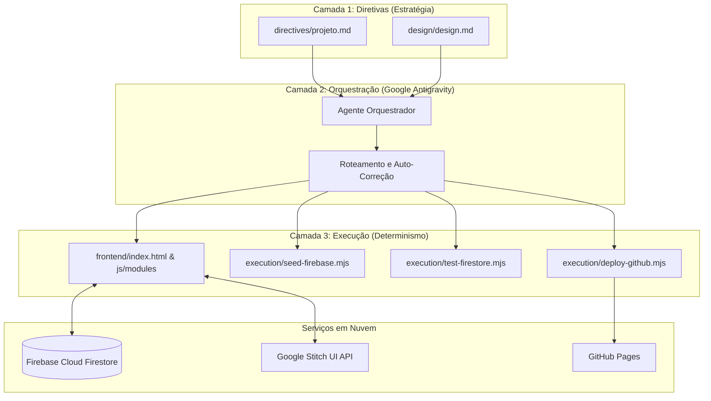

<div align="center">

# 🍔 BurguerSync Ourinhos
### *Sistema Full-Stack de Delivery Express & Esteira KDS em Tempo Real*
### *Full-Stack Real-Time Delivery & Kitchen Display System (KDS)*

[](https://deepmind.google)
[](https://firebase.google.com)
[](https://stitch.googleapis.com)
[](#)
[](https://sp.senai.br)

<p align="center">
  <a href="#-visão-geral-pt-br">🇧🇷 Português</a> •
  <a href="#-overview-en">🇺🇸 English</a> •
  <a href="#-arquitetura-3-camadas">Arquitetura</a> •
  <a href="#-instalação-e-execução">Instalação</a>
</p>

---

</div>

## 🇧🇷 Visão Geral (PT-BR)

O **BurguerSync Ourinhos** é uma plataforma full-stack moderna concebida para otimizar e digitalizar todo o fluxo de uma hamburgueria artesanal de ponta a ponta. Ele resolve os gargalos de perda de comandas e latência de comunicação integrando:

1. **Visão do Cliente (Autosserviço & Delivery):** Cardápio interativo com fotos de alta resolução geradas via IA, filtros por categoria, carrinho com cálculo dinâmico de taxa de entrega para os bairros de Ourinhos e checkout express com geração de chave Pix oficial, cartão ou dinheiro com troco.
2. **Rotas & Raio Logístico:** Mapeamento visual das áreas de cobertura de Ourinhos com tabela de bairros e prazos de entrega estimados.
3. **Visão da Cozinha (KDS - Kitchen Display System):** Esteira de pedidos em tempo real sincronizada via **Firebase Cloud Firestore**, com listeners reativos (`onSnapshot`), máquina de estados dos pedidos (`Recebido` ➔ `Em Preparo` ➔ `Saiu para Entrega` ➔ `Entregue`) e alertas visuais de pedidos críticos.

Desenvolvido integralmente no ambiente **Google Antigravity**, aproveitando agentes autônomos e o protocolo de execução em 3 camadas.

---

## 🇺🇸 Overview (EN)

**BurguerSync Ourinhos** is a cutting-edge, real-time restaurant management and delivery platform built to digitize and streamline artisan burger shop operations from end to end:

1. **Customer Self-Service & Ordering Interface:** Interactive catalog featuring AI-generated high-resolution product photography, category filters, interactive cart with dynamic delivery fee calculations across Ourinhos neighborhoods, and streamlined checkout with instant Pix QR/copy-paste key, card, or cash.
2. **Delivery Routes & Radius Hub:** Interactive visual coverage map of Ourinhos city districts, displaying estimated delivery times and zone fees.
3. **Kitchen Display System (KDS):** Live Kanban board reacting instantaneously to incoming customer orders powered by **Firebase Cloud Firestore** real-time listeners (`onSnapshot`), automated status state transitions (`Received` ➔ `In Preparation` ➔ `Out for Delivery` ➔ `Delivered`), and visual pulse alerts for orders waiting over 20 minutes.

Engineered end-to-end within the **Google Antigravity** IDE, orchestrated by autonomous AI agents.

---

## 🤖 Agentes de IA & Skill Packs (Google Antigravity)

Este repositório foi arquitetado e construído utilizando o ecossistema **Google Antigravity**:

| Componente | Tipo | Papel no Projeto |
| :--- | :--- | :--- |
| **`@agente-orquestrador`** | Agente Primário | Orquestração da Camada 2, resolução de dependências e loop de autorrecuperação |
| **`@app-builder`** | Agente Especialista | Estruturação de arquitetura full-stack e boas práticas |
| **`@frontend-design`** | Skill Pack | Design System Dark Mode neon com microinterações fluidas |
| **`@clean-code`** | Skill Pack | Padrão pragmático de código modular sem dependências desnecessárias |
| **`@verify-changes`** | Skill Pack | Verificação empírica e testes determinísticos pré-deploy |
| **`StitchMCP`** | Servidor MCP | Geração e sincronização de telas e fotografia de alimentos |

---

## 🏗️ Arquitetura em 3 Camadas



---

## 🚀 Como Executar Localmente

### 1. Clonar o Repositório
```bash
git clone https://github.com/Miranhada07/aula-07-octavioferreira.git
cd aula-07-octavioferreira
```

### 2. Configurar o `.env`
Crie o arquivo `.env` na raiz conforme o `.env.example`:
```env
GITHUB_PERSONAL_KEY=seu_token_github
FIREBASE_apiKey=sua_api_key
FIREBASE_projectId=burguer-sync
```

### 3. Iniciar o Servidor Local
No Windows, basta dar um duplo clique em:
```cmd
executar.bat
```
Ou via terminal:
```bash
node execution/server.mjs
```
Acesse em seu navegador: **`http://localhost:3000`**

---

## 🧪 Testes e Automações Determinísticas

- **Testar Conexão com Firestore:**
  ```bash
  node execution/test-firestore.mjs
  ```
- **Popular Pedidos Iniciais de Teste:**
  ```bash
  node execution/seed-firebase.mjs
  ```
- **Publicar no GitHub & Pages:**
  ```bash
  node execution/deploy-github.mjs
  ```

---

<div align="center">
  <sub>Desenvolvido com excelência técnica por <strong>Octavio Ferreira</strong> no ecossistema <strong>Google Antigravity</strong> • SENAI Ourinhos Edition</sub>
</div>
